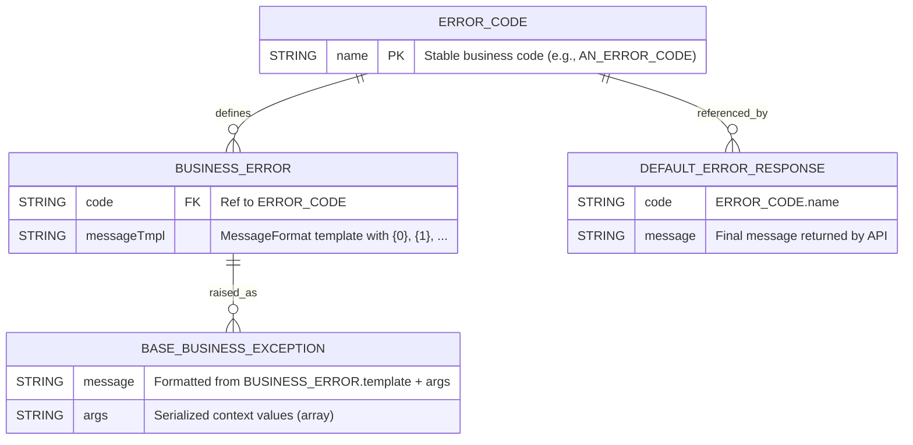

# Architecture Overview

This project follows a **Clean Architecture** with Spring Boot and a multi-module layout. The goal is to keep business rules independent from frameworks and I/O, while keeping wiring and infrastructure concerns isolated.

---

## Project Layout (root)

```
.
├── app/
│   ├── api/
│   │   └── src/main/java/.../api/
│   │       ├── web/controller/        # REST controllers (inbound adapters)
│   │       ├── dto/                   # API data transfer records
│   │       ├── mapper/                # DTO ↔ domain mapping
│   │       └── advice/                # Global exception handling + resolvers
│   ├── application/
│   │   └── src/main/java/.../application/
│   │       ├── invoker/               # Use cases / orchestration
│   │       └── mapper/                # Application ↔ domain mapping
│   ├── domain/
│   │   └── src/main/java/.../domain/
│   │       ├── commons/exceptions/    # BaseBusinessException, ErrorCode, BusinessError
│   │       ├── core/                  # Entities, value objects, domain services
│   │       └── modules/               # Subdomains / aggregates (e.g., example/)
│   ├── infrastructure/
│   │   └── src/main/java/.../infrastructure/
│   │       ├── persistence/jpa/       # JPA entities, repositories, mappers, adapters
│   │       ├── http/client/           # External REST clients (outbound adapters)
│   │       └── messaging/kafka/       # Producers, consumers, adapters
│   └── bootstrap/
│       ├── src/main/java/.../bootstrap/
│       │   ├── config/web/            # Spring @Configuration (FilterRegistrationBean, etc.)
│       │   └── web/filter/            # CorrelationIdFilter (X-Flow-Id → MDC + response header)
│       └── src/main/resources/
│           └── logback-spring.xml     # Log pattern including %X{X-Flow-Id}
├── docs/
│   ├── architecture/                  # This document
│   ├── diagrams/                      # PlantUML / draw.io / PNG diagrams
│   └── guidelines/                    # Conventions, ADRs, technical notes
└── http/
    ├── http-client.env.json           # IntelliJ HTTP Client environments (local/dev)
    └── health.http                    # Executable HTTP requests (replaces Postman)
```

---

## Responsibilities by directory

- **app/domain** — Business core. Entities, value objects, business rules, and business exceptions. **No framework dependencies**.
- **app/application** — Use case orchestration. Calls domain, drives outbound **ports** (interfaces implemented by infrastructure). No framework specifics.
- **app/api** — Inbound adapters (REST). Controllers, DTOs, mappers, and the `GlobalExceptionHandler` which turns domain exceptions into HTTP responses.
- **app/infrastructure** — Outbound adapters (persistence, messaging, external HTTP). Implements the ports required by `application`.
- **app/bootstrap** — Spring Boot wiring and runtime configuration (filters, bean registration, logging). The **CorrelationIdFilter** reads `X-Flow-Id` or generates one, stores it in MDC, and echoes it back as a response header.
- **docs** — Architecture docs, diagrams, guidelines.
- **http** — IDE-friendly HTTP request files and environments to test endpoints without Postman.

---

## Global Architecture (Mermaid)

```mermaid
flowchart LR
  subgraph Client
    Browser
    IDE_HTTP[IntelliJ HTTP Client]
    Curl
  end

  subgraph API[api (inbound adapters)]
    Controller[REST Controllers]
    Advice[GlobalExceptionHandler]
  end

  subgraph APP[application (use cases)]
    UseCases[Use Cases / Invokers]
    AppMappers[Mappers]
  end

  subgraph DOMAIN[domain (business)]
    Entities[Entities / Value Objects]
    Rules[Business Rules]
    Errors[BaseBusinessException + ErrorCode + BusinessError]
  end

  subgraph INFRA[infrastructure (outbound adapters)]
    DB[JPA Repositories]
    EXTHTTP[External REST Clients]
    MQ[Kafka Producers/Consumers]
  end

  subgraph BOOT[bootstrap (wiring)]
    Filter[CorrelationIdFilter\n(X-Flow-Id → MDC + response header)]
    Config[@Configuration beans]
  end

  Client --> Controller
  Controller --> UseCases
  UseCases --> DOMAIN
  UseCases -->|ports outbound| INFRA
  INFRA --> DB
  INFRA --> EXTHTTP
  INFRA --> MQ

  BOOT -.-> Filter
  BOOT -.-> Config
  Advice -.-> Controller
```

---

## Conceptual Data Model (Mermaid ER) — Error handling backbone



---

## Notes & conventions

- **Domain stays pure**: no Lombok or framework dependencies.
- **Singular technical package names**: `controller`, `dto`, `mapper`, `advice`, `resolver`.
- **Tracing**: `X-Flow-Id` is included in the response header and injected into MDC for logs.
- **Logging**: add `%X{X-Flow-Id}` to the Logback pattern (already configured in `bootstrap`).
- **HTTP tests**: use `http/health.http` with `http-client.env.json` (`local` / `dev` environments).

